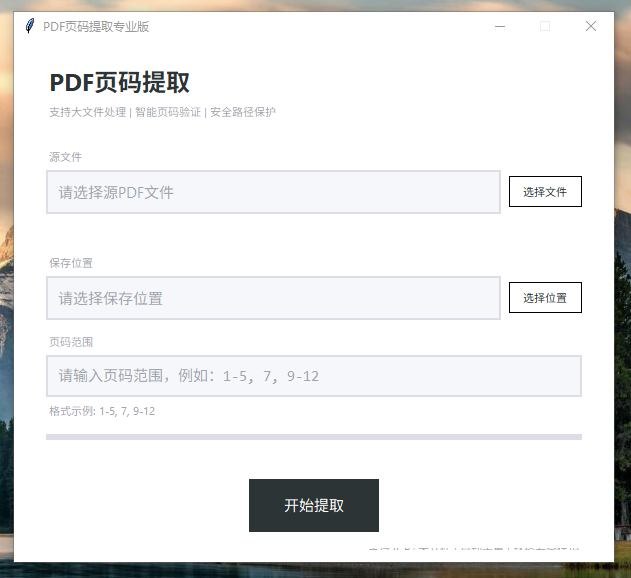

# PDF分页提取工具

## 项目概述

PDF分页提取工具是一个现代化的GUI应用程序，为从PDF文件中提取指定页码范围而设计。该工具采用现代简约的用户界面，结合强大的功能，为用户提供高效、安全的PDF处理体验。

## 🔧 主要功能

- **精准提取**：支持从PDF文件中提取任意指定页码范围
- **大文件支持**：优化的处理算法，支持最大2GB的PDF文件
- **智能验证**：自动验证页码范围，支持自动去重
- **安全防护**：严格的路径验证，防止路径穿越攻击
- **现代界面**：简约扁平化设计，直观易用
- **实时反馈**：处理过程中显示实时进度
- **详细信息**：展示PDF文件的总页数和文件大小

## 📸 界面预览



## 🚀 快速开始

### 所需依赖

- **PyPDF2**：用于PDF文件的读取和写入
- **tkinter**：用于创建图形用户界面（Python标准库）

### 安装方法

1. **使用pip安装依赖**
   ```bash
   pip install PyPDF2
   ```
2. **从requirements.txt安装**
   ```bash
   pip install -r requirements.txt
   ```
3. **运行应用**
   ```bash
   python PDF分页提取.py
   ```

## 📖 使用指南

### 基本操作

1. **选择源PDF文件**
   - 点击"选择文件"按钮浏览文件
   - 或直接在输入框中输入文件路径
2. **选择保存位置**
   - 点击"选择位置"按钮设置保存路径
   - 或直接在输入框中输入保存路径
3. **输入页码范围**
   支持多种格式：
   - 单个页码：`5`
   - 页码范围：`1-10`
   - 混合格式：`1-5, 7, 9-12`
4. **开始提取**
   - 点击"开始提取"按钮
   - 等待处理完成，查看结果提示

### 高级功能

- **自动去重**：系统会自动检测并移除重复的页码
- **文件信息**：选择文件后自动显示总页数和文件大小
- **错误处理**：提供详细的错误提示，帮助排查问题

## 🛠️ 技术架构

### 核心模块

1. **PathSecurity**：路径安全验证工具类
   - 规范化路径处理
   - 非法字符检查
   - 路径穿越攻击防护
   - 系统保护路径检查
2. **ValidationUtils**：输入验证工具类
   - 文件路径验证
   - 输出路径验证
   - 页码范围验证
   - 文件大小限制检查
3. **PDFProcessor**：PDF处理引擎
   - 大文件处理优化
   - 内存管理机制
   - 进度显示
   - 错误处理
4. **PDFExtractorApp**：主应用类
   - 用户界面管理
   - 事件处理
   - 业务逻辑协调

### 技术特点

- **面向对象设计**：模块化结构，提高代码可维护性
- **安全优先**：多重安全检查，防止恶意输入
- **性能优化**：针对大文件的内存管理策略
- **用户体验**：现代界面设计，清晰的操作反馈

## 🎨 界面设计

### 颜色方案

- **背景色**：#ffffff（纯白）
- **输入框背景**：#f5f7fa（浅灰）
- **边框颜色**：#dcdde6（中灰）
- **高亮颜色**：#4a90e2（蓝色）
- **文字颜色**：#2d3436（深灰）
- **占位文字**：#a0a4ac（浅灰）

### 交互特性

- **聚焦高亮**：输入框获得焦点时显示蓝色边框
- **鼠标悬浮**：鼠标悬停时输入框背景变为纯白
- **占位提示**：输入框显示灰色占位文字
- **实时进度**：处理过程中显示进度条和百分比

## 🔒 安全特性

- **路径验证**：严格检查文件路径的合法性
- **权限检查**：确保输出目录具有写入权限
- **文件验证**：检查文件是否存在、是否为PDF格式
- **大小限制**：防止处理过大的文件导致系统问题

## 🤝 贡献指南

欢迎对项目进行贡献！如果您有任何改进建议或发现了bug，请：

1. **报告问题**：在GitHub Issues中提交详细的问题描述
2. **提交代码**：Fork项目并提交Pull Request
3. **改进文档**：帮助完善README.md或其他文档

### 开发环境设置

1. 克隆项目仓库
2. 安装依赖：`pip install -r requirements.txt`

## 📄 许可证

本项目采用MIT许可证，详见[LICENSE](LICENSE)文件。

## ❓ 常见问题

### Q: 为什么提示"路径包含非法字符"？

A: 请检查文件路径是否包含以下非法字符：`<`, `>`, `"`, `|`, `?`, `*`

### Q: 为什么提示"文件超过2GB限制"？

A: 为了确保系统稳定性，工具限制处理最大2GB的PDF文件。

### Q: 页码范围支持哪些格式？

A: 支持单个页码（如`5`）、页码范围（如`1-10`）和混合格式（如`1-5, 7, 9-12`）

### Q: 为什么处理大文件时速度较慢？

A: 大文件处理需要更多的内存和计算资源，请耐心等待。建议在处理大文件时关闭其他占用系统资源的程序。

***

**版本**：1.0.0
**最后更新**：2026-04-18
**作者**：cc-Infiltration
